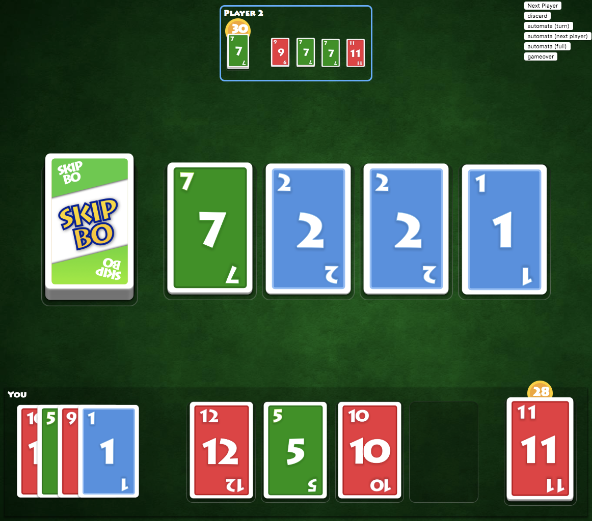

# Skipbo in Angular
This is SkipBo made in Angular — and it's only a rough proof of concept I want to archive for future references. This project is for learning purpose and not meant to hurt any copyright.

---

## What's in the box?

1. Rules of the games are implemented with a few core classes found in [src/app/skipbo-core](src/app/skipbo-core)

2. Angular application is only consuming the outputs in the shape of lists of cards.

3. I created all assets with Sketch and got the idea about the layout from the [official game app ](https://play.google.com/store/apps/details?id=com.magmic.googleplay.skipbo.free&hl=en).

There is also a [video (mp4)](docs/screencast.mp4).

  <video  width="320" height="240" controls
src='https://rawcdn.githack.com/georgiee/skipbo-angular/dbed878f415904d26f57652b99171bcc0000123d/docs/screencast.mp4'>

## What's missing

+ Angular Animations (I struggled with triggering animations of nested elements — despite knowing about query & animateChild)
+ Reactive Programming. That was the initial idea, create a core that implement all rules and provide a set of streams for all outputs. The problem here: This needs planning and doesn't fit to the experimental workflow I used for the project. Maybe I can creat something with the knowledge I gained in this project.